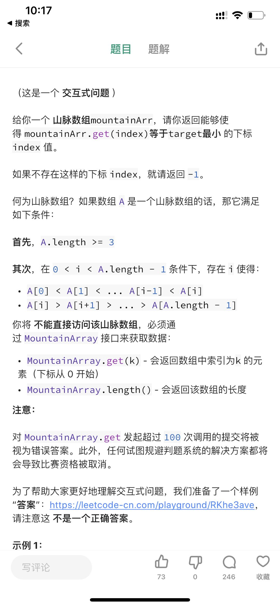
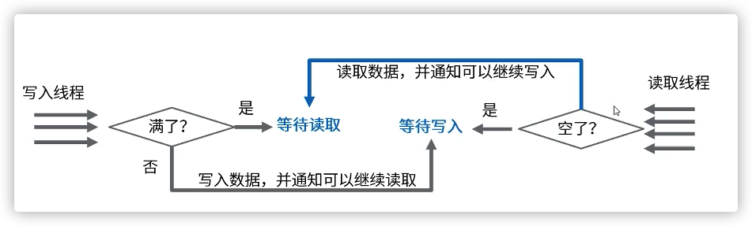

[toc]

***

# 2020-05-01

## 问题一：java 实现冒泡排序 [1,3,5,7,2,4,6,8]

```java
/**
 * 冒泡排序(O(n^2))
 *
 * @param array
 */
public static void bubble(int[] array) {
    // 轮数
    int len = array.length - 1;
    // 下轮交换次数
    int count = len;
    // 有序标志
    boolean isSorted = true;
    // 无序边界
    int sortBorder = 0;

    for (int i = 0; i < len; i++) {
        for (int j = 0; j < count; j++) {
            if (array[j] > array[j + 1]) {
                swap(array, j, j + 1);
                isSorted = false;
                sortBorder = j;
            }
        }
        if (isSorted) {
            break;
        }
        count = sortBorder;
    }
}
```


## 问题二：java 实现快速排序 [1,3,5,7,2,4,6,8]

```java
/**
 * 快速排序（O(nlogn)）
 *
 * @param arr
 * @param start
 * @param end
 */
public static void quickSort(int[] arr, int start, int end) {
    if (start >= end) {
        return;
    }

    // 得到基准位置
    int pivot = partition(arr, start, end);
    // 递归左边
    quickSort(arr, start, pivot - 1);
    // 递归右边
    quickSort(arr, pivot + 1, end);
}

/**
 * 获取基准位置（单边循环）
 *
 * @param arr
 * @param start
 * @param end
 * @return
 */
private static int partition(int[] arr, int start, int end) {
    // 当基准位置元素为最大或最小时, 时间复杂度退化成O(n^2)
    int pivot = arr[start];
    // 指向小于基准元素的区域边界
    int mark = start;
    // 从基准元素的下一个位置开始遍历
    for (int i = start + 1; i <= end; i++) {
        if (arr[i] < pivot) {
            //mark右移，因为小于pivot的区域边界增大了1
            mark++;
            // 因为最新遍历到的元素归属于小于pivot的区域
            swap(arr, mark, i);
        }
    }
    // 最后把基准元素pivot和mark所在位置元素交换
    arr[start] = arr[mark];
    arr[mark] = pivot;
    return mark;
}

private static void swap(int[] array, int i, int j) {
    int temp = array[i];
    array[i] = array[j];
    array[j] = temp;
}
```


## 问题三：java 实现二叉树排序 [1,3,5,7,2,4,6,8]

```java
/**
 * 二叉树节点
 */
private static class Node {
    /**
     * 根节点
     */
    private int data;
    /**
     * 左子树
     */
    private Node left;
    /**
     * 右子树
     */
    private Node right;

    public Node(int data) {
        this.data = data;
    }

    /**
     * 递归添加节点
     *
     * @param data
     */
    private void addNode(int data) {
        if (this.data > data) {
            if (this.left == null) {
                this.left = new Node(data);
            } else {
                this.left.addNode(data);
            }
        } else {
            if (this.right == null) {
                this.right = new Node(data);
            } else {
                this.right.addNode(data);
            }
        }
    }
}


/**
 * 构建二叉搜索树
 *
 * @param arr
 */
private static Node createBinarySearchTree(int[] arr) {
    Node node = null;
    for (int data : arr) {
        if (node == null) {
            node = new Node(data);
        } else {
            node.addNode(data);
        }
    }
    return node;
}

/**
 * 中序遍历（左子树、根节点、右子树）
 *
 * @param node
 */
private static void inOrderTraveral(Node node) {
    if (node == null) {
        return;
    }
    inOrderTraveral(node.left);
    System.out.println(node.data);
    inOrderTraveral(node.right);
}

/**
 * 二叉树排序：
 * 1. 构建一个二叉搜索树
 * 2. 将这个二叉搜索树按中序遍历
 *
 * @param arr
 */
public static void binarySearchSort(int[] arr) {
    Node node = createBinarySearchTree(arr);
    inOrderTraveral(node);
}

private static void swap(int[] array, int i, int j) {
    int temp = array[i];
    array[i] = array[j];
    array[j] = temp;
}
```


## 问题四：java 实现二分查找 [1,3,5,7,2,4,6,8,9]

```java
/**
 * 二分查找
 *
 * @param arr
 * @param key
 * @return 关键字位置
 */
public static int binarySearch(int[] arr, int key) {
    int low = 0;
    int high = arr.length - 1;
    int middle = 0;

    if (key < arr[low] || key > arr[high] || low > high) {
        return -1;
    }

    while (low <= high) {
        middle = (low + high) / 2;
        if (arr[middle] > key) {
            high = middle - 1;
        } else if (arr[middle] < key) {
            low = middle + 1;
        } else {
            return middle;
        }
    }

    return -1;
}
```


**验证：**

```java
public static void main(String[] args) {
	int[] array = new int[]{1, 3, 5, 7, 2, 4, 6, 8, 9};
	bubble(array);

	quickSort(array, 0, array.length - 1);
	System.out.println(Arrays.toString(array));

	int key = 5;
	int index = binarySearch(array, key);
	binarySearchSort(array);
}
```


***


# 020-05-02

## 问题一




```java
/**
 * 山脉数组对象
 */
private static class MountainArray {
    private int[] mountain;

    public MountainArray(int[] arr) {
        this.mountain = arr;
    }

    public int get(int index) {
        return mountain[index];
    }

    public int length() {
        return mountain.length;
    }
}

/**
 * 找到峰值索引
 *
 * @param mountainArray
 * @return
 */
public static int findPeak(MountainArray mountainArray) {
    int left = 0, right = mountainArray.length() - 1;
    while (left < right) {
        int mid = left + (right - left) / 2;
        if (mountainArray.get(mid) < mountainArray.get(mid + 1)) {
            left = mid + 1;
        } else {
            right = mid;
        }
    }
    System.out.println(MessageFormat.format("left: [{0}], right: [{1}]", left, right));
    return left;
}

/**
 * @param mountainArray 山脉数组
 * @param key           目标关键字
 * @param left          左边界
 * @param right         右边界
 * @param isUp          true: 递增
 * @return
 */
public static int binarySearch(MountainArray mountainArray, int key, int left, int right, 							boolean isUp) {
    while (left <= right) {
        int mid = left + (right - left) / 2;
        int tmp = mountainArray.get(mid);
        if (tmp == key) {
            return mid;
        }
        // 递增
        if (isUp) {
            if (tmp > key) {
                right = mid - 1;
            } else {
                left = mid + 1;
            }
        } else {
            if (tmp > key) {
                left = mid + 1;
            } else {
                right = mid - 1;
            }
        }
    }
    return -1;
}
```


**验证：**

```java
 public static void main(String[] args) {
     // 山脉数组
     int[] arr = new int[]{1, 3, 5, 8, 7, 6, 5, 4, 3, 2};
     MountainArray mountainArray = new MountainArray(arr);
     int peak = findPeak(mountainArray);
     System.out.println("search peak index: " + peak);
     int index = binarySearch(mountainArray, 5, 0, peak, true);
     if (index == -1) {
         index = binarySearch(mountainArray, 5, peak + 1, mountainArray.length(), false);
     }
     System.out.println("search key index: " + index);
 }
```


***

# 2020-05-03

## 问题一：同步和异步的区别和联系


## 问题二：nio和bio分别指什么？


## 问题三：两个进程共享一个公共的固定大小的缓冲区（BoundedBuffer）

其中一个是生产者，用于把消息放入缓冲区；另外一个是消费者，用于从缓冲区中取出消息。问题出现在当缓冲区已经满了，而此时生产者还想向其中放入一个新的数据项的情形，其解决方法是让生产者此时进行休眠，等待消费者从缓冲区中取走了一个或者多个数据后再去唤醒它。同样地，当缓冲区已经空了，而消费者还想去取消息，此时也可以让消费者进行休眠，等待生产者放入一个或者多个数据时再唤醒它。


**Condition与Lock配置使用：**



```java
public class QueueDemo {
    final Lock lock = new ReentrantLock();
    // 指定条件的等待 - 等待有空位
    final Condition notFull = lock.newCondition();
    // 指定条件的等待 - 等待不为空
    final Condition notEmpty = lock.newCondition();

    // 定义缓冲区
    final Object[] items = new Object[100];
    int putptr, takeptr, count;

    // 写入数据的线程,调用put
    public void put(Object x) throws InterruptedException {
        lock.lock();
        try {
            // 数据写满了
            while (count == items.length) {
                // 写线程阻塞
                notFull.await();
            }
            items[putptr] = x;
            if (++putptr == items.length) {
                putptr = 0;
            }
            ++count;
            // 唤醒指定条件的读线程
            notEmpty.signal();
        } finally {
            lock.unlock();
        }
    }
    // 读取数据的线程,调用take
    public Object take() throws InterruptedException {
        lock.lock();
        try {
            while (count == 0) {
                // 读线程阻塞
                notEmpty.await();
            }
            Object x = items[takeptr];
            if (++takeptr == items.length) {
                takeptr = 0;
            }
            --count;
            // 通知指定条件的写线程
            notFull.signal(); 
            return x;
        } finally {
            lock.unlock();
        }
    }
}
```


# 2020-05-07

## 问题一：分布式系统日志跟踪问题

> https://blog.csdn.net/zlt2000/article/details/99641821


## 问题二：单例模式实现的7种方式

* 懒汉，线程不安全

	```java
	public class Singleton {
	    private static Singleton instance;
	
	    private Singleton() {
	    }
	
	    public static Singleton getInstance() {
	        if (instance == null) {
	            instance = new Singleton();
	        }
	        return instance;
	    }
	} 
	```

	

* 懒汉，线程安全

	```java
	public class Singleton {
	    private static Singleton instance;
	
	    private Singleton() {
	    }
	
	    public static synchronized Singleton getInstance() {
	        if (instance == null) {
	            instance = new Singleton();
	        }
	        return instance;
	    }
	} 
	```

	

* 饿汉

	```java
	public class Singleton {
	    private static Singleton instance = new Singleton();
	
	    private Singleton() {
	    }
	
	    public static Singleton getInstance() {
	        return instance;
	    }
	} 
	```


* 饿汉，变种

	```
	public class Singleton {
	    private static Singleton instance = null;
	
	    static {
	        instance = new Singleton();
	    }
	
	    private Singleton() {
	    }
	
	    public static Singleton getInstance() {
	        return instance;
	    }
	}
	```


* 静态内部类

	```java
	public class Singleton {
	    private static class SingletonHolder {
	        private static final Singleton INSTANCE = new Singleton();
	    }
	
	    private Singleton() {
	    }
	
	    public static final Singleton getInstance() {
	        return SingletonHolder.INSTANCE;
	    }
	} 
	```


* 枚举

	```java
	public enum Singleton {  
	    INSTANCE;  
	    
	    public void whateverMethod() {  
	    }  
	} 
	```


* 双重校验锁

	```java
	public class Singleton {
	    private volatile static Singleton singleton;
	
	    private Singleton() {
	    }
	
	    public static Singleton getSingleton() {
	        if (singleton == null) {
	            synchronized (Singleton.class) {
	                if (singleton == null) {
	                    singleton = new Singleton();
	                }
	            }
	        }
	        return singleton;
	    }
	} 
	```

* > 更多：http://www.hollischuang.com/archives/205


## 问题三：static 有必要加voliate

* volatile, 声明这个字段易变（可能被多个线程使用），Java内存模型负责各个线程的工作区与主存区的该字段的值保持同步，即一致性。
* static, 声明这个字段是静态的（可能被多个实例共享），在主存区上该类的所有实例的该字段为同一个变量，即唯一性。
* volatile, 声明变量值的一致性；static,声明变量的唯一性。
* static 只是声明变量在主存上的唯一性，不能保证工作区与主存区变量值的一致性；除非变量的值是不可变的，即再加上final的修饰符，否则static声明的变量，不是线程安全的。

> 更多：https://www.jianshu.com/p/bda22c8a516f


## 问题四：题目：在一个二维数组中，每一行都按照从左到右递增的顺序排序，每一列都按照从上到下递增的顺序排序。请完成一个函数，输入这样的一个二维数组和一个整数，判断数组中是否含有该整数

```java
public static boolean search(int target, int[][] array) {

        int row = array.length;
        int col = array[0].length;

        int i = 0;
        while ((row > 0) && (i < col)) {
            if (target > array[row - 1][i]) {
                i++;
            } else if (target < array[row - 1][i]) {
                row--;
            } else {
                return true;
            }
        }
        return false;
    }
```


